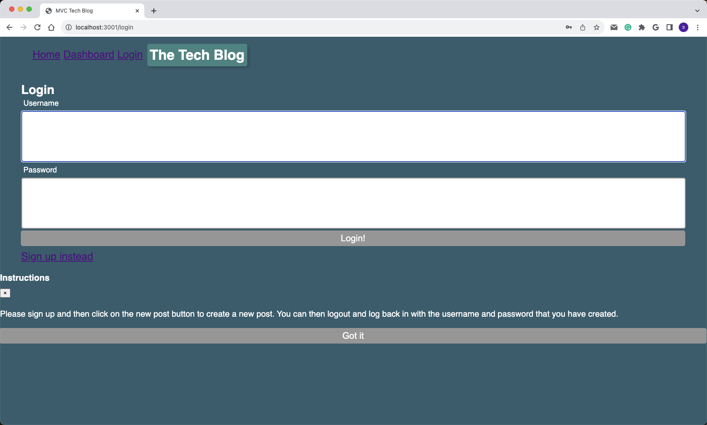

# Tech Blog - Full-Stack Web Application

## Table of Contents

- [Description](#description)
- [Features](#features)
- [Technologies Used](#technologies-used)
- [Installation](#installation)
- [Usage](#usage)
- [Database Setup](#database-setup)
- [Folder Structure](#folder-structure)
- [Contributing](#contributing)
- [License](#license)
- [Questions](#questions)

[](#description)
[](#features)
[](#technologies-used)
[](#installation)
[](#usage)
[](#database-setup)
[](#folder-structure)
[](#contributing)
[](#license)
[](#questions)



## Description

The Tech Blog is a full-stack web application that allows users to create accounts, write and publish blog posts, and interact with other users by adding comments to blog posts. It provides a platform for technology enthusiasts to share their thoughts and ideas with the community.

## Features

- **User Authentication:**
  - Users can sign up and create accounts.
  - Registered users can log in and log out.

- **Blog Post Management:**
  - Users can create, edit, and delete their own blog posts.
  - Users can view and comment on other users' blog posts.

- **Interactive Interface:**
  - A user-friendly web interface for posting, editing, and viewing blog posts.
  - Real-time updates for posts and comments without requiring page refresh.

[](#table-of-contents)

## Technologies Used

- **Front-end:**
  - HTML, CSS
  - JavaScript
  - [Bootstrap 5](https://getbootstrap.com/docs/5.0/getting-started/introduction/)
  - Handlebars.js
  - JavaScript Fetch API

- **Back-end:**
  - Node.js
  - Express.js
  - [Sequelize](https://sequelize.org/) (Object-Relational Mapping)
  - MySQL (or other database of your choice)

[](#table-of-contents)

## Installation

1. **Node.js and MySQL**: Make sure you have Node.js and MySQL installed on your local machine.

2. **Clone Repository**: Clone this repository to your local machine using Git.

   ```bash
   git clone <repository-url>

Install Dependencies: Navigate to the project's root directory and install the required Node.js packages.

bash
Copy code
npm install
Database Setup: If you are using MySQL, you may need to create the database, run migrations, and seed data. Make sure to configure your database connection in the config/connection.js file.

bash
Copy code
npx sequelize db:migrate
npx sequelize db:seed:all
Environment Variables: Set up environment variables as needed for your project. You may need to create a .env file for configuration.

Run the Application: Start the server.

bash
Copy code
npm start
Access the Application: Open a web browser and visit http://localhost:3001 to access the Tech Blog.

Back to Top

Usage
Users can navigate the website, view blog posts, and read comments without registering or logging in.
To create a blog post or leave comments, users must create an account or log in.
Back to Top

Database Setup
This project uses Sequelize as the Object-Relational Mapping (ORM) to interact with a MySQL database. You can find the database configuration in config/config.json. Sequelize migrations and seeders are provided to set up the initial database schema and seed data.

Back to Top

Folder Structure
The project's folder structure is organized as follows:

config: Contains configuration files, including database configuration.
controllers: Contains route controllers.
db: Automatically generated by Sequelize for migrations and seeders.
models: Contains the Sequelize models for your database tables.
public: Contains static files, including JavaScript, CSS, and images.
routes: Defines the project's Express.js routes.
utils: Contains utility files or functions.
views: Handlebars templates for rendering HTML.
Back to Top

Contributing
Contributions to this project are welcome. If you find issues or have suggestions for improvements, please open an issue or a pull request.

Back to Top

License
This project is licensed under the MIT License.

Back to Top

Questions
If you have any questions or need further assistance with the project, please feel free to contact the project owner via their GitHub profile:

GitHub Profile: Guadeloupe33